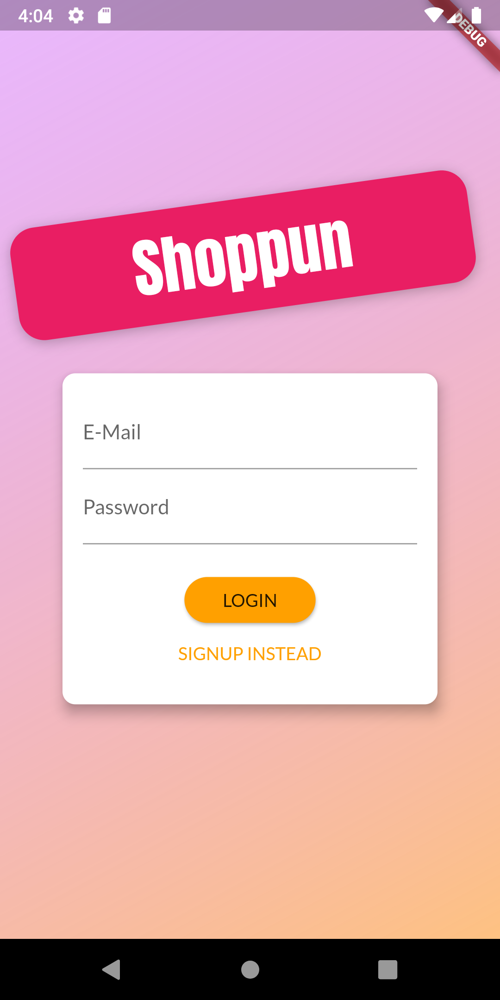
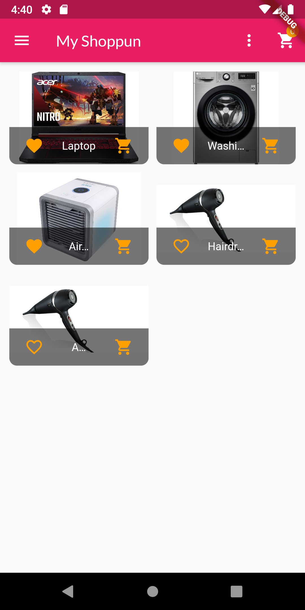
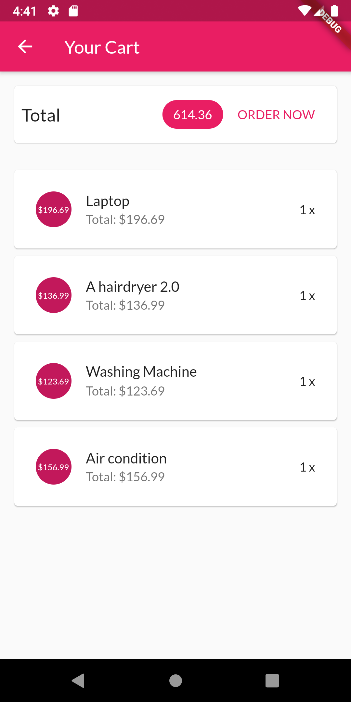
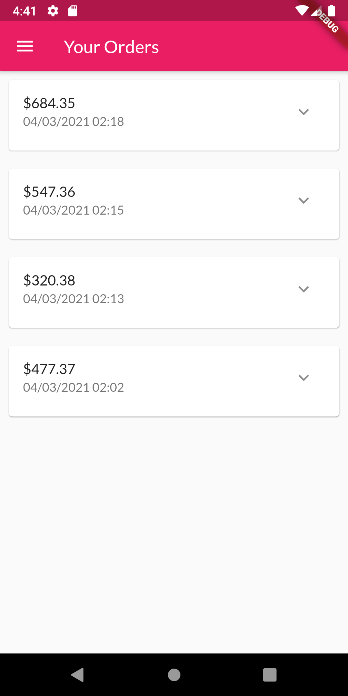
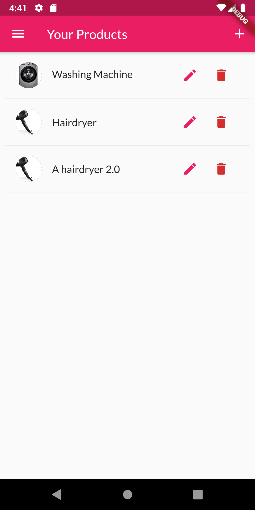

# Shoppun

## What is Shoppun?
**Shop + Fun = Shoppun**

An E-commerce mobile application that allow you to upload your products or buys products from the others.

## Technology
- Frontend
  - Flutter - Google's UI toolkit
  - Provider - State Management
  - Shared Preferences - Platform-specific persistent storage for simple data
- Backend
  - Firebase - Authentication, Realtime Database
## Some review images



## Getting Started

Before jump into run this application, you need to create `.env` file that have properties like `.env.example` file. Then replace `GOOGLE_API_KEY` value with your Google API key.
After create environment variables, run command
```
flutter run
```
# License & copyright

© Kirin Tran, FPT University TP.HCM
Licensed under the [MIT LICENSE](LICENSE).